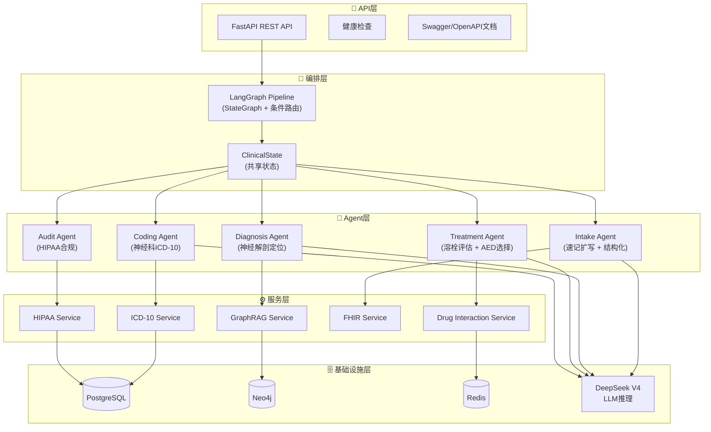
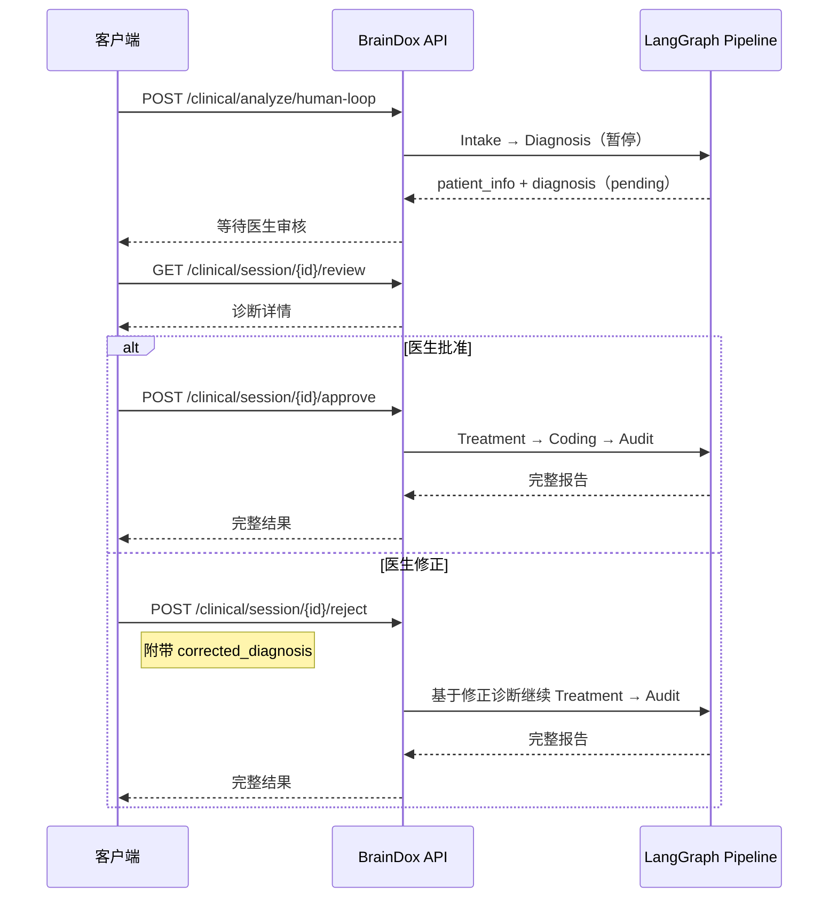

<div align="center">

# 🧠 BrainDox — 神经内科脑疾病临床辅助决策系统

**基于多Agent的神经内科脑疾病临床辅助决策系统**

[]()
[]()
[]()
[]()
[](LICENSE)
[]()
[]()

---

🎯 **专注于神经内科脑疾病的多Agent临床辅助决策系统**

覆盖 **接诊 → 诊断 → 治疗 → 编码 → 审计** 全流程，基于 DeepSeek V4 + LangGraph

> 💡 **核心特性**：Intake Agent 支持 **极简临床速记 → 结构化 JSON** 转换，大幅提升神经科医生工作效率

</div>

---

## 📑 目录

- [🌟 项目亮点](#-项目亮点)
- [🏗️ 系统架构](#️-系统架构)
- [🚀 快速开始](#-快速开始)
- [🤖 五个Agent详解](#-五个agent详解)
- [📡 API接口文档](#-api接口文档)
- [📂 项目目录结构](#-项目目录结构)
- [🔮 路线图](#-路线图)
- [📜 License](#-license)

---

## 🌟 项目亮点

| 亮点 | 说明 |
|:---:|:---|
| 🧠 **神经内科专属** | 专注脑血管疾病、癫痫、神经退行性疾病、脱髓鞘疾病、神经肌肉疾病、CNS感染、头痛等 |
| ⚡ **极简速记→结构化** | Intake Agent 将极简临床速记（如 `65M, S L weakness 2h, GCS14, L Babinski+`）转化为结构化 PatientInfo JSON |
| 🤖 **5个专业Agent** | Intake → Diagnosis → Treatment → Coding → Audit，支持条件路由和人机协同 |
| 🧠 **GraphRAG知识图谱** | 神经内科专属症状→疾病→治疗多跳推理，基于Neo4j |
| 🏥 **神经科数据模型** | 专属 NeurologicalExam 和 NeuroImaging 字段，支持GCS、MRC肌力分级、巴彬斯基征、CT/MRI影像 |
| 📋 **神经科ICD-10** | G00-G99（神经系统）+ I60-I69（脑血管）ICD-10-CM编码 + MS-DRGs分组 |
| 💊 **神经科DDI** | 药物交互数据库覆盖抗癫痫药、抗凝药、抗血小板药、帕金森药、免疫调节剂 |
| 🔒 **HIPAA合规** | Safe Harbor脱敏（18类PHI）、不可变审计日志、RBAC访问控制 |
| 🔄 **人机协同** | 医生可审核、批准或修正LLM诊断后再进入治疗阶段 |

---

## 🏗️ 系统架构

### Pipeline 流程


### 分层架构



### 为什么用多Agent而不是一个大Agent？

| 对比维度 | 单Agent | 多Agent Pipeline（本项目） |
|:---|:---|:---|
| **准确性** | � 提示词过长，注意力分散 | 🟢 每个Agent专注一个任务，Prompt精准 |
| **可维护性** | 🔴 改一个功能可能影响所有功能 | 🟢 修改某个Agent不影响其他Agent |
| **可测试性** | 🔴 只能端到端测试 | 🟢 每个Agent可以独立单元测试 |
| **可观测性** | 🔴 黑盒，不知道哪步出问题 | 🟢 每步有输入/输出，便于调试 |
| **错误隔离** | 🔴 一处出错整个流程失败 | 🟢 单Agent出错可以跳过或重试 |

---

## 🚀 快速开始

### 前置条件

| 工具 | 版本要求 | 用途 |
|:---|:---|:---|
| Python | 3.11+ | 运行时 |
| Anaconda | — | 环境管理（推荐） |
| Docker | 20.0+ | 基础设施服务 |
| DeepSeek API Key | — | LLM推理 |

### 安装步骤

```bash
# 进入代码目录
cd code
# 创建 UV 虚拟环境
uv venv
# 激活环境
.\.venv\Scripts\activate
# 安装依赖
uv pip install -r requirements.txt

# 配置 API Key
copy .env.example .env

# 编辑 .env 文件，填入你的 DeepSeek API Key：
#   OPENAI_API_KEY=sk-your-deepseek-api-key
#   OPENAI_MODEL=deepseek-v4-pro
#   OPENAI_BASE_URL=https://api.deepseek.com

# ④ 启动基础设施（PostgreSQL + Neo4j + Redis）
docker compose up -d postgres neo4j redis
# 等待约10秒，让数据库完全启动

# ⑤ 启动API服务
uvicorn src.api.main:app --host 0.0.0.0 --port 8000 --reload

# ✅ 看到以下输出说明启动成功：
#   INFO:     Uvicorn running on http://0.0.0.0:8000
```

### 环境变量详解

```bash
# ============== LLM 配置 ==============
# DeepSeek API密钥（必填！）
OPENAI_API_KEY=sk-your-deepseek-api-key
# 模型名称
OPENAI_MODEL=deepseek-v4-pro
# DeepSeek API地址
OPENAI_BASE_URL=https://api.deepseek.com

# ============== PostgreSQL 配置 ==============
POSTGRES_HOST=localhost
POSTGRES_PORT=5432
POSTGRES_DB=clinical_decision
POSTGRES_USER=postgres
POSTGRES_PASSWORD=your-password-here

# ============== Neo4j 配置 ==============
NEO4J_URI=bolt://localhost:7687
NEO4J_USER=neo4j
NEO4J_PASSWORD=your-password-here

# ============== Redis 配置 ==============
REDIS_HOST=localhost
REDIS_PORT=6379

# ============== 应用配置 ==============
APP_HOST=0.0.0.0
APP_PORT=8000
LOG_LEVEL=INFO
```

> 💡 只有 `OPENAI_API_KEY`、`OPENAI_MODEL`、`OPENAI_BASE_URL` 是**必须**修改的，其他保持默认即可。

### 验证运行

打开浏览器访问 http://localhost:8000/docs 查看Swagger UI，或用PowerShell测试：

```powershell
Invoke-RestMethod -Uri "http://localhost:8000/health" -Method Get
```

---

## 🤖 五个Agent详解

### Agent 1: Intake Agent（极简速记 → 结构化）

BrainDox的核心创新。将医生的极简临床速记转化为结构化患者数据，采用两阶段处理：

**阶段1 — 临床扩写**（内部处理，不输出）：

| 扩写类型 | 示例 |
|:---|:---|
| **缩写展开** | `AF` → atrial fibrillation（房颤），`SAH` → subarachnoid hemorrhage（蛛网膜下腔出血），`tPA` → tissue plasminogen activator（组织型纤溶酶原激活剂） |
| **语义扩展** | `L Babinski+` → 左侧巴彬斯基征阳性，提示上运动神经元损害；`R hemiplegia` → 右侧偏瘫，提示左大脑半球病变（对侧） |
| **缺失推断** | 卒中无发病时间 → 标记"需补充最后正常时间以评估溶栓窗口"；癫痫无发作类型 → 标记"需补充发作症状学分类" |

**阶段2 — 结构化输出**：生成包含神经科专属字段的 PatientInfo JSON。

**输入示例**：
```
65M, S L weakness 2h, GCS14 E4V4M6, R gaze, L facial droop UMN type,
LUE 2/5 LLE 3/5, L Babinski+, L hemisensory loss, BP178/95 HR88.
AF+HTN h/o. Meds: warfarin 5mg qd, amlodipine 10mg qd.
NCCT: no hemorrhage, R MCA territory early ischemic changes.
```

**输出结构**：
```
PatientInfo
├── name, age, gender, chief_complaint
├── symptoms[]                    # 症状列表（duration_days支持浮点数，如0.0833=2小时）
├── medical_history[]             # 既往病史
├── allergies[]                   # 过敏史
├── current_medications[]         # 当前用药
├── vital_signs                   # 生命体征
├── lab_results[]                 # 实验室检查
├── neurological_exam             # 🔬 神经科专属检查
│   ├── consciousness_level       #   意识水平（GCS评分）
│   ├── pupil_response            #   瞳孔对光反射
│   ├── motor_strength            #   肌力（MRC分级0-5，按肢体）
│   ├── pathological_reflexes     #   病理反射（Babinski、Hoffmann等）
│   ├── cranial_nerves            #   脑神经检查
│   ├── sensory_exam              #   感觉检查
│   ├── coordination              #   共济运动
│   ├── gait                      #   步态
│   ├── meningeal_signs           #   脑膜刺激征
│   └── speech                    #   言语评估
└── neuro_imaging[]               # 🔬 神经影像学
    ├── modality                   #   检查类型（CT/MRI/DSA/MRA/CTA）
    ├── findings                   #   影像所见
    └── conclusion                 #   影像诊断
```

**关键代码**：[`code/src/agents/intake_agent.py`](code/src/agents/intake_agent.py)

---

### Agent 2: Diagnosis Agent（神经科鉴别诊断）

生成带神经解剖定位的排名鉴别诊断：

- **专科领域**：脑血管疾病（卒中、TIA、SAH、ICH）、癫痫、神经退行性疾病（帕金森、阿尔茨海默、ALS）、脱髓鞘疾病（MS、ADEM）、神经肌肉疾病（GBS、MG）
- **神经解剖定位**：输出病变定位（如左MCA供血区、脑干、脊髓T8水平、周围神经），并提供定位依据
- **条件路由**：如果信息不足（`needs_more_info=true`），Pipeline回退到Intake Agent补充信息，最多重试2次

**输出结构**：
```json
{
  "primary_diagnosis": {
    "disease_name": "Ischemic Stroke - Left MCA Territory",
    "icd10_hint": "I63.511",
    "confidence": 0.88,
    "evidence": ["sudden left weakness 2h", "GCS 14", "L Babinski+"],
    "reasoning": "急性起病+左侧偏瘫+右侧凝视+左病理征阳性→左MCA区缺血性卒中"
  },
  "neuroanatomical_localization": {
    "location": "Left MCA territory",
    "reasoning": "右侧凝视（左额叶眼动区）+左侧面瘫UMN型+左偏瘫+左偏身感觉障碍"
  },
  "differential_list": [...],
  "recommended_tests": ["CTA head/neck", "MRI brain with diffusion", "Echo"],
  "needs_more_info": false
}
```

**关键代码**：[`code/src/agents/diagnosis_agent.py`](code/src/agents/diagnosis_agent.py)

---

### Agent 3: Treatment Agent（神经科治疗方案）

生成循证治疗方案，包含神经科特有的急性干预和药物选择：

- **急性干预评估**：
  - 溶栓评估：发病时间窗、禁忌症检查（如正在使用华法林）
  - 手术考虑：去骨瓣减压术、血肿清除术、动脉瘤夹闭术
  - ICU监护：颅内压监测、气道管理、血流动力学支持
- **药物选择**：
  - 抗癫痫药（AED）选择：根据癫痫类型和药物交互
  - 抗凝管理：华法林/DOAC调整
  - 疾病修饰治疗：MS的干扰素/奥法妥木单抗等
- **DDI检查**：自动检测推荐药物与当前用药的交互

**关键代码**：[`code/src/agents/treatment_agent.py`](code/src/agents/treatment_agent.py)

---

### Agent 4: Coding Agent（神经科ICD-10编码）

将诊断映射为ICD-10-CM编码，遵循神经科特有编码规则：

**覆盖的ICD-10范围**：

| 编码范围 | 类别 | 示例 |
|:---|:---|:---|
| G00-G09 | CNS炎症性疾病 | G00.9 细菌性脑膜炎，G03.9 脑膜炎 |
| G10-G14 | 主要影响CNS的系统萎缩 | G10 亨廷顿病，G12.21 ALS |
| G20-G26 | 锥体外系和运动障碍 | G20 帕金森病，G24.1 肌张力障碍 |
| G35-G37 | 脱髓鞘疾病 | G35 多发性硬化，G36.9 ADEM |
| G40-G47 | 发作性和阵发性障碍 | G40.109 局灶性癫痫，G43.909 偏头痛 |
| G60-G65 | 神经/多发性神经病 | G61.0 GBS，G70.0 MG |
| G80-G83 | 脑瘫/瘫痪综合征 | G81.1 轻偏瘫，G83.1 单瘫 |
| I60-I69 | 脑血管疾病 | I63.511 左MCA脑梗，I61.9 脑出血 |

**DRGs分组示例**：

| ICD-10前缀 | DRG | 描述 | 权重 | 平均住院天数 |
|:---|:---|:---|:---|:---|
| I63 | 061 | 缺血性卒中（溶栓） | 2.5 | 5.8 |
| I61 | 064 | 颅内出血（伴MCC） | 2.3 | 6.2 |
| I60 | 066 | 蛛网膜下腔出血（伴MCC） | 3.1 | 8.5 |
| G40 | 101 | 癫痫（伴MCC） | 1.3 | 3.8 |
| G20 | 076 | 帕金森病 | 1.1 | 3.5 |
| G35 | 077 | 多发性硬化 | 1.6 | 4.2 |

**关键代码**：[`code/src/agents/coding_agent.py`](code/src/agents/coding_agent.py)

---

### Agent 5: Audit Agent（HIPAA合规审计）

纯规则引擎（不使用LLM，确保100%确定性）：

- **PHI扫描与脱敏**：正则表达式扫描18类HIPAA Safe Harbor标识符，自动掩码处理
- **8项结构性合规检查**：
  1. phi_scan — PHI泄露扫描
  2. data_encryption_at_rest — 静态数据加密
  3. data_encryption_in_transit — 传输数据加密
  4. access_control_rbac — RBAC访问控制
  5. audit_logging — 审计日志
  6. minimum_necessary_rule — 最小必要原则
  7. breach_notification_ready — 违规通知就绪
  8. data_retention_policy — 数据保留策略
- **不可变审计追踪**：所有操作记录写入审计日志，保留6年
- **风险评估**：基于检查结果给出整体风险等级（low / medium / high）

**关键代码**：[`code/src/agents/audit_agent.py`](code/src/agents/audit_agent.py)

---

### GraphRAG 知识图谱

神经内科专属症状-疾病映射，辅助Diagnosis Agent进行鉴别诊断：

```python
# code/src/services/graphrag_service.py

SYMPTOM_DISEASE_MAP = {
    "headache":        ["Migraine", "Tension Headache", "SAH", "Meningitis", "Intracranial Hypertension", "Brain Tumor"],
    "seizure":         ["Epilepsy", "Brain Tumor", "Ischemic Stroke", "ICH", "Meningitis", "Encephalitis"],
    "limb_weakness":   ["Ischemic Stroke", "ICH", "GBS", "MS", "Spinal Cord Compression", "MG", "ALS"],
    "altered_mentation":["Encephalitis", "Meningitis", "Ischemic Stroke", "Hepatic Encephalopathy", "Status Epilepticus"],
    "visual_disturbance":["MS", "Migraine", "Brain Tumor", "Optic Neuritis", "IIH", "Temporal Arteritis"],
    # ... 更多症状映射
}

DISEASE_ICD10_MAP = {
    "Ischemic Stroke":            {"code": "I63.9", "desc": "Cerebral infarction, unspecified"},
    "Intracerebral Hemorrhage":   {"code": "I61.9", "desc": "Nontraumatic intracerebral hemorrhage"},
    "Subarachnoid Hemorrhage":    {"code": "I60.9", "desc": "Nontraumatic subarachnoid hemorrhage"},
    "Epilepsy":                   {"code": "G40.9", "desc": "Epilepsy, unspecified"},
    "Multiple Sclerosis":         {"code": "G35",   "desc": "Multiple sclerosis"},
    "Parkinson Disease":          {"code": "G20",   "desc": "Parkinson disease"},
    # ... 更多疾病映射
}
```

**查询逻辑**：通过"投票计数"算法排序——被更多症状指向的疾病排名更高。

**关键代码**：[`code/src/services/graphrag_service.py`](code/src/services/graphrag_service.py)

---

### 药物交互数据库

神经科常用药物交互数据，Treatment Agent自动调用检查：

**典型交互示例**：

| 药物A | 药物B | 严重级别 | 风险 |
|:---|:---|:---|:---|
| warfarin | carbamazepine | 🔴 **major** | CBZ诱导CYP2C9，降低华法林抗凝效果 |
| valproic_acid | lamotrigine | 🔴 **major** | VPA抑制LTG代谢，血药浓度升高2倍，SJS/TEN风险 |
| warfarin | aspirin | 🔴 **major** | 出血风险显著增加 |
| levetiracetam | — | 🟢 一般 | 左乙拉西坦药物交互少，神经科首选AED |
| levodopa | metoclopramide | ⛔ **禁忌** | 胃复安阻断多巴胺受体，加重帕金森症状 |

**关键代码**：[`code/src/services/drug_interaction.py`](code/src/services/drug_interaction.py)

---

## 📡 API接口文档

### 接口总览

| 方法 | 路径 | 说明 | 需要LLM |
|:---|:---|:---|:---:|
| `POST` | `/api/v1/clinical/analyze` | 完整5-Agent Pipeline | ✅ |
| `POST` | `/api/v1/clinical/analyze/human-loop` | 人机协同Pipeline（诊断后暂停） | ✅ |
| `GET` | `/api/v1/clinical/session/{id}/review` | 获取待审核诊断 | ❌ |
| `POST` | `/api/v1/clinical/session/{id}/approve` | 批准诊断，继续Pipeline | ❌ |
| `POST` | `/api/v1/clinical/session/{id}/reject` | 修正诊断，继续Pipeline | ❌ |
| `POST` | `/api/v1/clinical/icd10/search` | ICD-10文本搜索 | ❌ |
| `GET` | `/api/v1/clinical/icd10/{code}` | ICD-10编码查询 | ❌ |
| `POST` | `/api/v1/clinical/ddi/check` | 药物交互检查 | ❌ |
| `GET` | `/health` | 健康检查 | ❌ |

### 1. 完整Pipeline分析

**`POST /api/v1/clinical/analyze`**

运行完整的5-Agent临床决策Pipeline。

```powershell
Invoke-RestMethod -Uri "http://localhost:8000/api/v1/clinical/analyze" `
  -Method Post `
  -ContentType "application/json" `
  -Body '{"patient_description": "65M, S L weakness 2h, GCS14 E4V4M6, R gaze, L facial droop UMN type, LUE 2/5 LLE 3/5, L Babinski+, L hemisensory loss, BP178/95 HR88. AF+HTN h/o. Meds: warfarin 5mg qd, amlodipine 10mg qd. NCCT: no hemorrhage, R MCA territory early ischemic changes.", "thread_id": "stroke-001"}'
```

**请求参数**：

| 字段 | 类型 | 必填 | 说明 |
|:---|:---|:---|:---|
| `patient_description` | string | ✅ | 极简临床速记或完整患者叙述（最少2字符） |
| `thread_id` | string | ❌ | 会话ID，用于状态持久化（默认"default"） |

**响应字段**：

| 字段 | 说明 |
|:---|:---|
| `patient_info` | Intake Agent输出的结构化患者信息 |
| `diagnosis` | Diagnosis Agent输出的鉴别诊断 |
| `treatment_plan` | Treatment Agent输出的治疗方案 |
| `coding_result` | Coding Agent输出的ICD-10编码+DRGs |
| `audit_result` | Audit Agent输出的HIPAA合规报告 |
| `errors` | 错误列表 |

### 2. 人机协同流程



**完整调用流程**：

1. `POST /clinical/analyze/human-loop` — 启动Pipeline，执行Intake→Diagnosis后在Treatment前暂停
2. `GET /clinical/session/{thread_id}/review` — 医生查看待审核诊断
3. `POST /clinical/session/{thread_id}/approve` — 医生批准诊断，Pipeline继续执行
4. `POST /clinical/session/{thread_id}/reject` — 医生修正诊断，Pipeline基于修正版继续执行

### 3. ICD-10搜索

**`POST /api/v1/clinical/icd10/search`**

```powershell
Invoke-RestMethod -Uri "http://localhost:8000/api/v1/clinical/icd10/search" `
  -Method Post `
  -ContentType "application/json" `
  -Body '{"query": "stroke"}'
```

### 4. ICD-10编码查询

**`GET /api/v1/clinical/icd10/{code}`**

```powershell
Invoke-RestMethod -Uri "http://localhost:8000/api/v1/clinical/icd10/I63.9" -Method Get
```

### 5. 药物交互检查

**`POST /api/v1/clinical/ddi/check`**

```powershell
Invoke-RestMethod -Uri "http://localhost:8000/api/v1/clinical/ddi/check" `
  -Method Post `
  -ContentType "application/json" `
  -Body '{"new_drugs": ["warfarin"], "current_drugs": ["carbamazepine"]}'
```

### 6. 健康检查

**`GET /health`**

```powershell
Invoke-RestMethod -Uri "http://localhost:8000/health" -Method Get
```

---

## 📂 项目目录结构

```
BrainDox/
│
├── 📁 code/                                # Python实现
│   ├── src/
│   │   ├── agents/                         # 五个Agent实现
│   │   │   ├── intake_agent.py             # 极简速记扩写 + 结构化
│   │   │   ├── diagnosis_agent.py          # 神经科鉴别诊断
│   │   │   ├── treatment_agent.py          # 神经科治疗方案 + DDI检查
│   │   │   ├── coding_agent.py             # 神经科ICD-10 + DRGs
│   │   │   └── audit_agent.py              # HIPAA合规 + PHI脱敏
│   │   ├── api/                            # FastAPI REST API
│   │   │   ├── main.py                     # 应用入口（中间件、路由注册）
│   │   │   └── routes.py                   # 接口定义（analyze/icd10/ddi/human-loop）
│   │   ├── graph/                          # LangGraph Pipeline编排
│   │   │   ├── clinical_pipeline.py        # StateGraph + 条件路由 + HITL
│   │   │   └── state.py                    # ClinicalState共享状态
│   │   ├── models/                         # Pydantic数据模型
│   │   │   ├── patient.py                  # PatientInfo + NeurologicalExam + NeuroImaging
│   │   │   ├── diagnosis.py                # DifferentialDiagnosis模型
│   │   │   └── treatment.py                # TreatmentPlan/CodingResult/AuditResult
│   │   ├── services/                       # 业务服务层
│   │   │   ├── graphrag_service.py         # 神经科知识图谱（SYMPTOM_DISEASE_MAP）
│   │   │   ├── icd10_service.py            # 神经科ICD-10（G00-G99, I60-I69）+ DRGs
│   │   │   ├── drug_interaction.py         # 神经科DDI数据库
│   │   │   ├── fhir_service.py             # FHIR R4资源转换
│   │   │   └── hipaa_service.py            # HIPAA PHI检测/脱敏/审计
│   │   └── config/
│   │       └── settings.py                 # 环境配置（Pydantic Settings）
│   ├── tests/
│   │   └── test_services.py                # 服务层测试
│   ├── data/
│   │   └── sample_patients.json            # 测试病例
│   ├── .env.example                        # 环境变量模板
│   ├── requirements.txt                    # Python依赖
│   ├── Dockerfile                          # 容器镜像
│   └── docker-compose.yml                  # 基础设施（PG + Neo4j + Redis）
│
├── 📁 docker/
│   └── init-db.sql                         # PostgreSQL初始化（审计日志表 + 会话表）
│
├── 📁 docs/                                # 技术文档
│   ├── 00-项目概览.md
│   ├── 01-环境搭建指南.md
│   ├── 02-架构设计详解.md
│   ├── 03-Agent设计原理.md
│   ├── 04-GraphRAG知识图谱.md
│   ├── 05-FHIR-API集成.md
│   ├── 06-HIPAA合规设计.md
│   └── 07-部署运维指南.md
│
├── .gitignore
├── LICENSE
└── README.md
```

---

## 🔮 路线图

### 近期计划

- [ ] 🧪 **LoRA微调**：收集300-500条"极简速记→结构化JSON"配对数据，使用LoRA（rank=16-32）微调DeepSeek/Qwen医疗模型，优化速记扩写效果
- [ ] 🔄 **流式输出**：通过SSE（Server-Sent Events）实现Agent逐步输出
- [ ] 📊 **Pipeline可视化**：前端展示Pipeline执行过程

### 中期计划

- [ ] 🌐 **前端Dashboard**：Vue前端，包含患者信息表单、诊断结果展示、Pipeline可视化
- [ ] 📈 **监控告警**：Prometheus + Grafana Agent级别性能监控
- [ ] 🔐 **OAuth 2.0 / JWT认证**：完整的用户认证和授权
- [ ] 📋 **完整ICD-10库**：导入全部72,000+编码

### 远期计划

- [ ] 🧠 **真实Neo4j知识图谱**：导入UMLS / SNOMED CT医学本体
- [ ] 🌍 **多语言支持**：中文/英文双语诊断
- [ ] 🤝 **多租户架构**：支持多家医院数据隔离
- [ ] 📊 **A/B测试框架**：不同Prompt策略效果对比

---

## 📜 License

[MIT License](LICENSE)

> ⚠️ **免责声明**：本项目仅用于学习和演示目的。不得用于真实临床诊断或医疗决策。任何医疗决策都应由持有执照的医疗专业人员做出。
