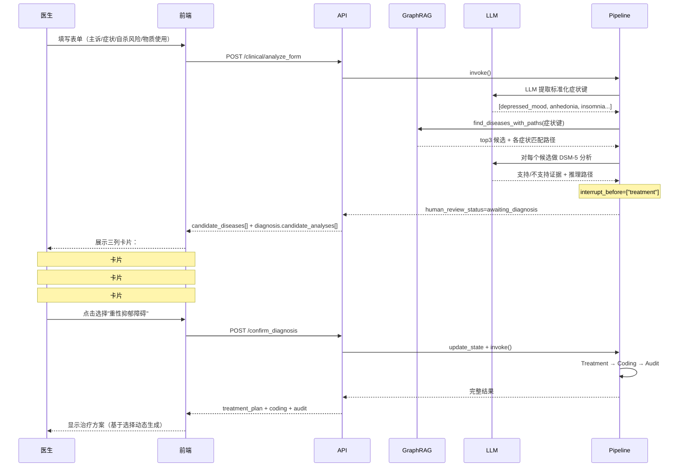

<div align="center">

# BrainDox — 精神科多Agent临床决策辅助系统

[]()
[]()
[]()
[]()
[]()
[]()

**精神科诊断 → 人机协同 → 循证治疗** 全链路，从知识图谱到LLM推理，医生全程可控

</div>

## 核心流程

```
医生填写表单 → GraphRAG 检索 top3 候选 → LLM 逐个分析 → 前端展示 3 张卡片（含图路径+推理）
    → 医生选择诊断 → 动态治疗方案 → ICD-10编码 → 合规审计
                              ↑
                    人机协同（Human-in-the-Loop）
```

> 与纯自动化 Agent 方案的**本质区别**在于：诊断结果不是直接输出给下游，而是先中断，等医生看了 GraphRAG 路径和 LLM 推理后人工确认，再进入治疗阶段。

## 架构亮点

| 层次 | 说明 |
|:---|:---|
| **知识图谱检索** | LLM 从患者信息提取标准化症状键 → `SYMPTOM_DISEASE_MAP` 投票计数 → 返回 top3 候选疾病 + 图路径链 |
| **LLM 推理分析** | DeepSeek 对每个候选疾病独立做 DSM-5 证据分析：支持证据、不支持证据、推理路径、置信度 |
| **人机协同中断** | Pipeline 在 Diagnosis 后调用 `interrupt_before=["treatment"]`，等待医生在前端选择 |
| **动态治疗** | Treatment Agent 读取 `selected_disease`，根据医生选择的诊断动态调整方案 |
| **双模式降级** | Neo4j 图数据库 / 离线 Python 字典自动切换。LLM 提取症状失败时静默降级到规则别名映射 |
| **信息两段检查** | `sufficiency_check` 节点将症状/主诉（硬阻断）与自杀风险/物质使用（软提示）分层判断 |

## 人机协同流程



## 3 张候选诊断卡片的含义

```
┌─────────────────────────────────────────────────────┐
│ 鉴别诊断 — 请选择最可能的诊断                        │
├─────────────┬─────────────┬─────────────────────────┤
│  #1 MDD     │  #2 双相II  │  #3 GAD                 │
│  F32.9      │  F31.81     │  F41.1                  │
│  匹配 5/6   │  匹配 3/6   │  匹配 2/6               │
├─────────────┼─────────────┼─────────────────────────┤
│ 图检索路径:  │ 图检索路径: │ 图检索路径:              │
│ 情绪低落 →  │ 早醒 →     │ 焦虑 → GAD              │
│ 快感缺失 →  │ 迟滞 →     │                         │
│ 早醒 →      │ 双相II     │                         │
│ 体重下降 →  │            │                         │
│ 自杀意念 →  │            │                         │
│ 迟滞 → MDD  │            │                         │
├─────────────┼─────────────┼─────────────────────────┤
│ 支持证据:    │ 支持证据:   │ 支持证据:                │
│ • 符合A标准  │ • ...      │ • ...                   │
│ • 功能损害   │            │                         │
│ 不支持证据:  │            │                         │
│ • 无         │            │                         │
│ 临床推理路径:│            │                         │
│ 核心症状组合 │            │                         │
│ +病程6周     │            │                         │
│ → MDD 诊断  │            │                         │
└─────────────┴─────────────┴─────────────────────────┘
           ↓
    已选择：重性抑郁障碍
    [确认诊断，继续治疗方案]
```

- **图检索路径**：GraphRAG 从患者的症状列表出发，在 `SYMPTOM_DISEASE_MAP` 中找出哪些症状与当前疾病关联。
- **支持/不支持证据**：LLM 将候选疾病与 DSM-5 诊断标准逐条对比。
- **临床推理路径**：LLM 的综合分析——为何该诊断成立，以及与其它候选的鉴别要点。

## 为什么需要医生选择

1. **GraphRAG 的局限性**：知识图谱是基于症状-疾病关联的统计投票（而非因果推理），可能出现假阳性——例如"失眠"既关联 MDD 也关联 GAD，但患者可能是原发失眠障碍。
2. **LLM 的局限性**：LLM 可能有"锚定偏见"——倾向于选择排第一的候选而忽视不典型的临床表现。
3. **临床不可替代的信息**：患者的面部表情、语气、医患互动中的非语言线索，LLM 无法获取但医生可以综合判断。

## 症状检索链

```
医生表单输入"情绪低落、兴趣丧失、早醒、体重下降、被动自杀意念"

         ↓ LLM 提取（方案A — LLM 语义理解）

标准化键：[depressed_mood, anhedonia, early_morning_awakening, weight_loss, suicidal_ideation]

         ↓ SYMPTOM_DISEASE_MAP 投票

depressed_mood     → [MDD, 双相II, 恶劣心境, ...]
anhedonia          → [MDD, 双相抑郁, SCZ阴性症状, ...]
early_morning_awakening → [MDD, 广泛性焦虑障碍, 双相障碍]
weight_loss        → [神经性厌食症, MDD, 物质使用障碍, ...]
suicidal_ideation  → [MDD, 双相障碍, BPD, SCZ, ...]

         ↓ 计数排序

MDD (5票) > 双相II/双相抑郁 (3票) > GAD/恶劣心境 (2票) > ...

         ↓ LLM 逐个分析候选

候选1: MDD    → 支持证据5条, 不支持0条, 置信度0.85
候选2: 双相II → 支持3条, 不支持2条(否认轻躁狂史), 置信度0.30
候选3: GAD   → 支持2条, 不支持3条(缺乏焦虑核心症状), 置信度0.15
```

如果 LLM 调用失败（API Key 余额不足 / 网络超时），会静默降级到规则别名映射（`SYMPTOM_ALIAS`），不中断流程。

## 动态治疗

- Treatment Agent 读取 `state.selected_disease`（医生选择的诊断）。
- 如果医生选择了"双相II型障碍（当前抑郁发作）"而不是 MDD，治疗方案会**自动调整为**心境稳定剂 + 抗抑郁药谨慎使用（避免诱发躁狂），而非标准的 SSRI 单药治疗。
- 如果医生未选择（`selected_disease` 为空），默认使用 LLM 的 `primary_recommendation`。

## 技术栈

| 组件 | 选型 | 用途 |
|:---|:---|:---|
| **LLM推理** | DeepSeek V4 | 症状提取（temperature=0.0）、诊断分析（temperature=0.2） |
| **Pipeline编排** | LangGraph | StateGraph + 条件路由 + interrupt_before HITL |
| **API服务** | FastAPI | RESTful API，`/analyze_form` + `/confirm_diagnosis` |
| **知识图谱** | Neo4j / 离线字典 | 精神科症状 → 疾病映射，双模式自动降级 |
| **前端** | Vue 3 + Naive UI | 表单输入 → 候选诊断三列卡片 → 治疗/编码/审计面板 |
| **数据校验** | Pydantic v2 | `ClinicalState` 共享状态，`.env` 配置 |
| **状态持久化** | MemorySaver | Pipeline 中断/恢复，`_pipeline_instances` 缓存 |

## 项目结构

```
BrainDox/
├── code/
│   ├── src/
│   │   ├── api/
│   │   │   ├── main.py              # FastAPI 入口 + lifespan
│   │   │   └── routes.py            # /analyze_form + /confirm_diagnosis + ICD10 + DDI
│   │   ├── agents/
│   │   │   ├── diagnosis_agent.py    # LLM 症状提取 + GraphRAG 检索 + DSM-5 分析 + HITL
│   │   │   ├── treatment_agent.py    # 动态治疗（基于 selected_disease）
│   │   │   ├── coding_agent.py       # ICD-10 编码
│   │   │   └── audit_agent.py        # HIPAA 合规（纯规则引擎）
│   │   ├── graph/
│   │   │   ├── state.py             # ClinicalState（含 candidate_diseases/selected_disease）
│   │   │   └── pipeline_compiler.py # LangGraph 编译 + HITL interrupt_before
│   │   ├── services/
│   │   │   ├── graphrag_service.py  # GraphRAG 检索 + SYMPTOM_DISEASE_MAP + 别名映射
│   │   │   ├── drug_interaction.py  # DDI 检查
│   │   │   ├── icd10_service.py     # ICD-10 搜索
│   │   │   └── hipaa_service.py     # PHI 脱敏
│   │   ├── models/
│   │   │   ├── patient.py           # PatientInfo, Gender
│   │   │   └── diagnosis.py         # DiagnosisResult
│   │   └── config/
│   │       └── settings.py          # .env 配置
│   └── .env
└── fe/
    ├── src/
    │   ├── App.vue                  # 主组件：表单→候选卡片→选择→治疗/编码/审计面板
    │   ├── api/
    │   │   └── index.ts             # API 客户端（analyzeForm + confirmDiagnosis）
    │   ├── types/
    │   │   └── index.ts             # TypeScript 接口
    │   ├── components/
    │   │   ├── PipelineStepper.vue  # 步骤指示器
    │   │   ├── TreatmentPanel.vue
    │   │   ├── CodingPanel.vue
    │   │   └── AuditPanel.vue
    │   └── test-data.ts             # 初诊/复诊测试用例
    └── vite.config.ts
```

## API 端点

| 方法 | 路径 | 说明 |
|:---|:---|:---|
| `POST` | `/api/v1/clinical/analyze_form` | 提交表单启动 Pipeline（诊断后 HITL 中断） |
| `POST` | `/api/v1/clinical/confirm_diagnosis` | 医生确认诊断，恢复 Pipeline |
| `POST` | `/api/v1/clinical/icd10/search` | ICD-10 文本搜索 |
| `GET` | `/api/v1/clinical/icd10/{code}` | ICD-10 编码查询 |
| `POST` | `/api/v1/clinical/ddi/check` | 药物交互检查 |
| `GET` | `/health` | 健康检查 |

### 表单分析请求

```json
{
  "chief_complaint": "情绪低落、兴趣丧失、早醒、体重下降伴自杀意念，持续约一个半月",
  "symptoms": "情绪低落, 兴趣丧失, 早醒, 体重下降, 被动自杀意念, 精神运动性迟滞",
  "suicide_risk": "低风险 - 被动自杀意念，无具体计划，无既往尝试，家属可监护",
  "substance_use": "否认吸烟、饮酒及药物滥用史",
  "scenario": "new_visit",
  "thread_id": "session-123"
}
```

### 诊断确认请求

```json
{
  "thread_id": "session-123",
  "selected_disease": "重性抑郁障碍"
}
```

## 快速开始

### 前置条件

- Python 3.11+
- UV（推荐）或 Pip
- DeepSeek API Key

### 安装

```bash
cd code

# UV 环境
uv venv
source .venv/Scripts/activate  # Windows
uv pip install -r requirements.txt

# 配置
cp .env.example .env
# 修改 .env：OPENAI_API_KEY, OPENAI_MODEL, OPENAI_BASE_URL

# 启动后端
uv run uvicorn src.api.main:app --reload --host 0.0.0.0 --port 8001
```

### 启动前端

```bash
cd fe
npm install
npm run dev
```

打开浏览器访问 `http://localhost:5173`，表单已预填测试用例，点击"开始分析"即可体验。

## 已知限制

- **SYMPTOM_DISEASE_MAP 覆盖有限**：目前约 57 个标准化症状键，罕见症状无法匹配
- **Neo4j 空库问题**：`.env` 配置了 Neo4j 密码但图数据库无数据时，Cypher 查询返回空且不触发离线降级（当前的 `find_diseases_with_paths` 已绕过此问题，直接走离线字典）
- **单 LLM 故障点**：症状提取和分析使用同一个 API Key，Key 失效时两个功能都不可用（但 GraphRAG 候选卡片仍能显示）

## License

MIT
